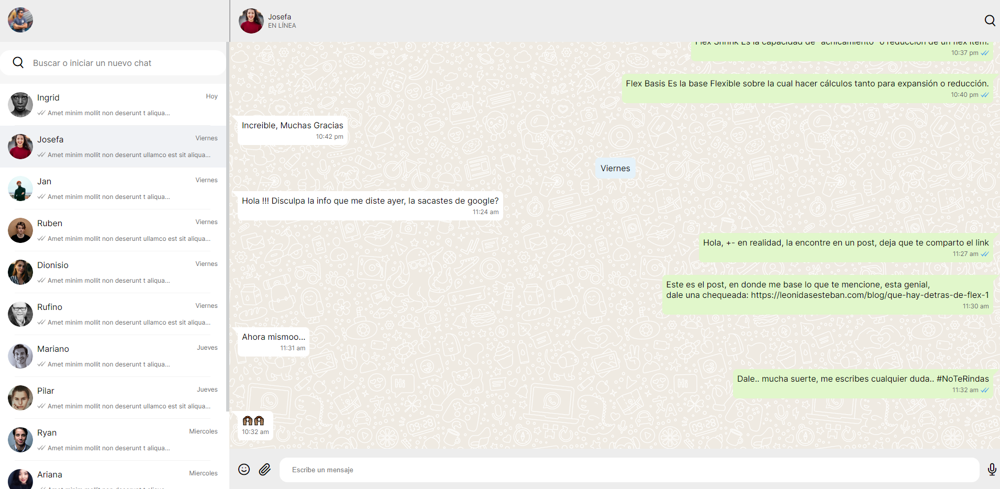
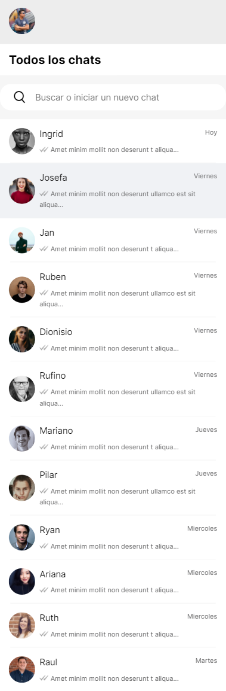

#  Gestor de correos
Construimos la interfase responsive de la plataforma favorita de muchos, para mantenerse en contacto con familiares y amigos.

## Desktop

## Mobile

## Disclaimer

Todas son propuestas, el propósito de **/Proyectos** es brindarte el diseño, el límite de la creación lo dictan tus ganas de hacerlo realidad y tu skills del momento a la hora de codear.

## Revisión

Recuerda mandar tu proyecto a revisión, si aún no conoces como funciona el proceso de revisión lee este post: [Como usar proyectos en 3 pasos](https://leonidasesteban.com/blog/como-usar-proyectos-en-3-pasos)

## Créditos

Encuentra más proyectos asombrosos en [/Proyectos](https://leonidasesteban.com/proyectos)

Diseñado con ♥️ en leonidasesteban.com